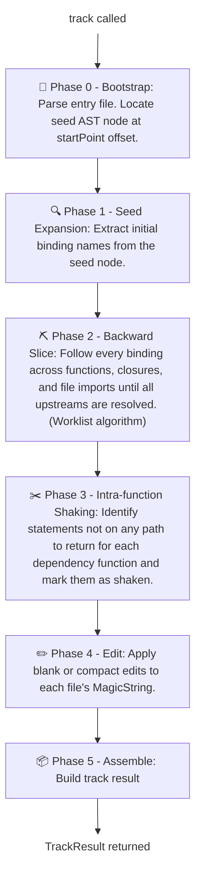
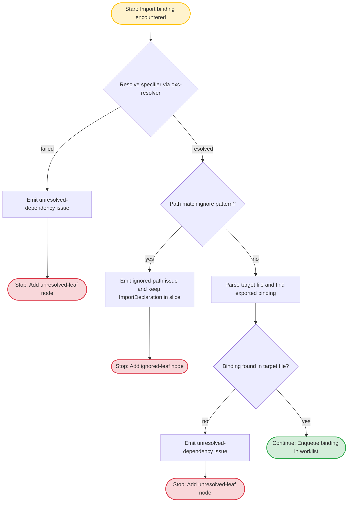
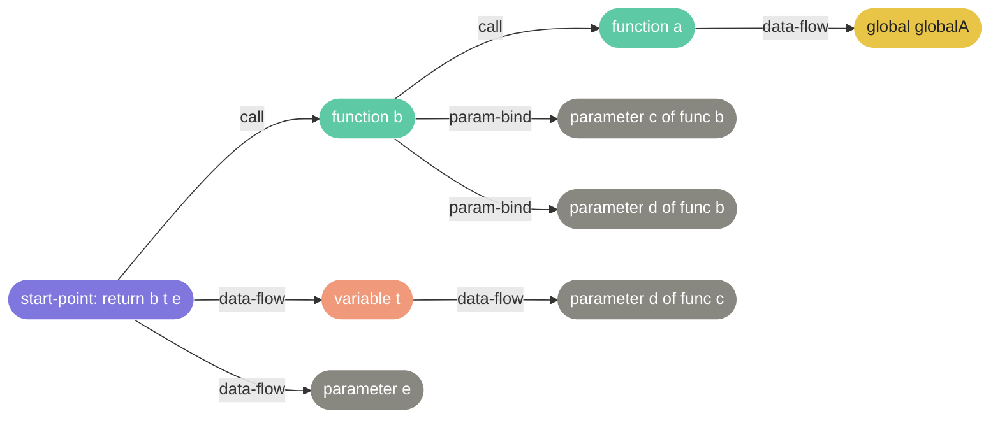

# lineage

Project starts on 17-05-2026

[](https://github.com/soranoo/lineage/actions/workflows/ci.yaml) [](LICENSE) &nbsp;&nbsp;&nbsp;[](https://github.com/soranoo/Donation)

<!-- [](https://github.com/soranoo/lineage) -->

[](https://www.npmjs.com/package/@soranoo/lineage) [](https://www.npmjs.com/package/@soranoo/lineage)

Follow the lineage of any value, across every file.

Give me a ⭐ if you like it.

---

## 📖 Table of Contents

- [📌 Knowledge Prerequisites](#-knowledge-prerequisites)
- [✨ Features](#-features)
- [🚀 Getting Started](#-getting-started)
- [⚙️ How It Works](#️-how-it-works)
- [📦 API Reference](#-api-reference)
  - [DependencyTracker](#dependencytracker)
  - [offsetFromLineCol](#offsetfromlinecol)
  - [TrackResult](#trackresult)
  - [nodes](#nodes--dependencynode)
  - [edges](#edges--dependencyedge)
  - [issues](#issues--trackerissue)
  - [files](#files--slicedfile)
  - [Error Types](#error-types)
- [⭐ TODO](#-todo)
- [🐛 Known Issues](#-known-issues)
- [🤝 Contributing](#-contributing)
- [⚠️ Disclaimer](#️-disclaimer)
- [📝 License](#-license)
- [☕ Sponsorship](#-sponsorship)

---

## 📌 Knowledge Prerequisites

It is recommended to have a basic understanding of the following concepts before using Lineage:

- **Abstract Syntax Trees (ASTs)**: Lineage operates on the [AST](https://en.wikipedia.org/wiki/Abstract_syntax_tree) representation of your code. Familiarity with ASTs will help you understand how Lineage analyzes and traverses your codebase.

- **Graph Theory**: Lineage constructs a [directed graph](https://en.wikipedia.org/wiki/Directed_graph) of dependencies. Understanding nodes, edges, and traversal algorithms will help you interpret the results.

- **Static Analysis**: Lineage performs [static analysis](https://en.wikipedia.org/wiki/Static_program_analysis) to determine dependencies without executing the code. Familiarity with static analysis techniques will help you understand the limitations and capabilities of Lineage.

> [!TIP]\
> AI is always your friend. If you are unfamiliar with any of these concepts, consider using AI tools to quickly get up to speed.

## ✨ Features

- **Backward dependency slicing**: given any statement or expression as a start point, Lineage traces every variable, function, parameter, and import that could influence its value
- **Cross-file analysis**: follows `import` and `re-export` chains across your entire codebase, not just a single file
- **Intra-function tree shaking**: statements inside a dependency function that do not contribute to its return value are identified and flagged separately
- **Ignore patterns**: exclude folders or files from recursion using strings or RegExp (e.g. `generated/`, `/vendor/`); `node_modules` is always excluded implicitly
- **Unresolved dependency reporting**: when a binding cannot be traced to a definition, Lineage keeps a placeholder leaf node in the graph instead of silently dropping it
- **Dynamic pattern detection**: `eval`, computed properties, indirect calls, `arguments`, and other statically unresolvable patterns are detected and reported with the conservative action taken

---

## 🚀 Getting Started

### Installation

```bash
npm install @soranoo/lineage
```

> [!TIP]\
> Replace `npm` with `bun`, `yarn` or `pnpm` if you prefer those package managers.

### Basic usage

```ts
import { DependencyTracker, offsetFromLineCol } from "@soranoo/lineage";
import { writeFile, mkdir } from "fs/promises";
import { dirname } from "path";

const SOURCE_PATH = "./demo/main.js";

const source = `
const globalA = 0;

function a(b, c) {
    return c + 2 * b + globalA;
}
function b(c, d) {
    return a(c, d);
}
function c(d, e) {
    const t = d + 5;
    return b(t, e);
}

const result = c(5, 6);
`.trimStart();

// Write the source to a file so that Lineage can read it
await mkdir(dirname(SOURCE_PATH), { recursive: true });
await writeFile(SOURCE_PATH, source);

// Convert a human-friendly line/col into the offset Lineage needs
const start = offsetFromLineCol(source, 11, 5); // line 11, col 5 -> "return b(t, e);"
const end = offsetFromLineCol(source, 11, 20);

const tracker = new DependencyTracker();

const result = await tracker.track({
  entryFile: SOURCE_PATH,
  startPoint: { start, end },
  output: { mode: "blank" }, // "blank" (default) | "compact"
});

// Sliced source - non-dependency lines are blanked out
console.log(result.files.get(SOURCE_PATH)?.ms.toString());

// Dependency graph nodes
console.log(result.nodes); // See "Output - 1" below

// Directed edges between nodes
console.log(result.edges); // See "Output - 2" below

// Issues (unresolved deps, dynamic patterns, ignored paths)
console.log(result.issues); // See "Output - 3" below
```

Output - 1:
```json
[
  {
    id: "./demo/main.js:158:173",
    file: "./demo/main.js",
    range: {
      start: 158,
      end: 173,
    },
    label: "return b(t, e);",
    kind: "start-point",
    shaken: false,
  }, {
    id: "./demo/main.js:73:113",
    file: "./demo/main.js",
    range: {
      start: 73,
      end: 113,
    },
    label: "function b(c, d) {\n    return a(c, d);\n}",
    kind: "function",
    shaken: false,
  }, {
    id: "./demo/main.js:84:85",
    file: "./demo/main.js",
    range: {
      start: 84,
      end: 85,
    },
    label: "c",
    kind: "parameter",
    shaken: false,
  }, {
    id: "./demo/main.js:87:88",
    file: "./demo/main.js",
    range: {
      start: 87,
      end: 88,
    },
    label: "d",
    kind: "parameter",
    shaken: false,
  }, {
    id: "./demo/main.js:143:152",
    file: "./demo/main.js",
    range: {
      start: 143,
      end: 152,
    },
    label: "t = d + 5",
    kind: "variable",
    shaken: false,
  }, {
    id: "./demo/main.js:128:129",
    file: "./demo/main.js",
    range: {
      start: 128,
      end: 129,
    },
    label: "e",
    kind: "parameter",
    shaken: false,
  }, {
    id: "./demo/main.js:20:72",
    file: "./demo/main.js",
    range: {
      start: 20,
      end: 72,
    },
    label: "function a(b, c) {\n    return c + 2 * b + globalA;\n}",
    kind: "function",
    shaken: false,
  }, {
    id: "./demo/main.js:34:35",
    file: "./demo/main.js",
    range: {
      start: 34,
      end: 35,
    },
    label: "c",
    kind: "parameter",
    shaken: false,
  }, {
    id: "./demo/main.js:31:32",
    file: "./demo/main.js",
    range: {
      start: 31,
      end: 32,
    },
    label: "b",
    kind: "parameter",
    shaken: false,
  }, {
    id: "./demo/main.js:125:126",
    file: "./demo/main.js",
    range: {
      start: 125,
      end: 126,
    },
    label: "d",
    kind: "parameter",
    shaken: false,
  }, {
    id: "./demo/main.js:6:17",
    file: "./demo/main.js",
    range: {
      start: 6,
      end: 17,
    },
    label: "globalA = 0",
    kind: "global",
    shaken: false,
  }
]
```

Output - 2:
```json
[
  {
    from: "./demo/main.js:158:173",
    to: "./demo/main.js:73:113",
    kind: "call",
  }, {
    from: "./demo/main.js:158:173",
    to: "./demo/main.js:84:85",
    kind: "param-bind",
  }, {
    from: "./demo/main.js:158:173",
    to: "./demo/main.js:87:88",
    kind: "param-bind",
  }, {
    from: "./demo/main.js:158:173",
    to: "./demo/main.js:143:152",
    kind: "data-flow",
  }, {
    from: "./demo/main.js:158:173",
    to: "./demo/main.js:128:129",
    kind: "data-flow",
  }, {
    from: "./demo/main.js:73:113",
    to: "./demo/main.js:20:72",
    kind: "call",
  }, {
    from: "./demo/main.js:73:113",
    to: "./demo/main.js:34:35",
    kind: "param-bind",
  }, {
    from: "./demo/main.js:73:113",
    to: "./demo/main.js:31:32",
    kind: "param-bind",
  }, {
    from: "./demo/main.js:143:152",
    to: "./demo/main.js:125:126",
    kind: "data-flow",
  }, {
    from: "./demo/main.js:20:72",
    to: "./demo/main.js:6:17",
    kind: "data-flow",
  }
]
```

Output - 3:
```json
[]
```

### With ignore patterns

```ts
const tracker = new DependencyTracker({
  // Stop recursing into these paths - they become leaf nodes in the graph
  ignorePatterns: [
    "/project/src/generated/", // string: tested with path.includes()
    /\/vendor\//,              // RegExp: tested with pattern.test()
  ],
});
```

> [!NOTE]\
> `node_modules` is always an implicit ignore pattern regardless of what you pass to `ignorePatterns`. You never need to add it manually.

### With virtual files (no disk writes)

```ts
import { DependencyTracker, offsetFromLineCol } from "@soranoo/lineage";

const entrySource = [
  "import { add } from './math';",
  "const left = 1;",
  "const right = 2;",
  "export const result = add(left, right);",
].join("\n");

const tracker = new DependencyTracker({
  virtualFiles: {
    "/virtual/main.ts": entrySource,
    "/virtual/math.ts": "export const add = (a: number, b: number): number => a + b;",
  },
});

const start = offsetFromLineCol(entrySource, 4, 14); // "result = add(left, right)"
const end = offsetFromLineCol(entrySource, 4, 39);

const result = await tracker.track({
  entryFile: "/virtual/main.ts",
  startPoint: { start, end },
  output: { mode: "blank" },
});

console.log(result.nodes);
console.log(result.edges);
console.log(result.issues);
```

> [!NOTE]\
> Virtual file keys must be absolute paths beginning with `/`. A non-absolute key throws `InvalidVirtualPathError`.

> [!NOTE]\
> Virtual import resolution supports both same-directory (`./...`) and parent-directory (`../...`) relative specifiers.

> [!NOTE]\
> Mix is supported, virtual files and physical disk files can participate in the same trace.
> This works in both directions: a virtual entry can import real files, and a real entry can import virtual modules.

### Reusing a tracker across multiple analyses

```ts
const tracker = new DependencyTracker();

// First call - parses and caches all files it touches
const result1 = await tracker.track({ entryFile: "/project/src/main.ts", startPoint: { start: 10, end: 40 } });

// Second call - cached files are reused; only new files are parsed
const result2 = await tracker.track({ entryFile: "/project/src/main.ts", startPoint: { start: 55, end: 90 } });
```

> [!TIP]\
> Each `track()` call returns an independent `TrackResult`. Results never bleed into each other - issues, nodes, and `MagicString` instances are all fresh per call.

---

## ⚙️ How It Works

Lineage runs five phases every time `track()` is called:



### Cross-file resolution

When the worklist encounters an import, it resolves the specifier using [`oxc-resolver`](https://github.com/oxc-project/oxc-resolver) and checks the result against the ignore filter before recursing:



### Output graph shape

For a simple three-function chain (`c` calls `b`, `b` calls `a`) (See above [section](#basic-usage) for the full code), the graph Lineage produces looks like this:



> [!NOTE]\
> `const result = c(5, 6)` does **not** appear in the graph. Lineage traces backward from the start point where consumers of a value are never included, only producers.

---

## 📦 API Reference

### `DependencyTracker`

The only exported class. Create one instance per project configuration and reuse it across multiple `track()` calls.

```ts
const tracker = new DependencyTracker(config?: TrackerConfig);
```

**`TrackerConfig`**

| Field | Type | Default | Description |
|---|---|---|---|
| `resolver` | `OxcResolverOptions` | `undefined` | Options forwarded verbatim to [`oxc-resolver`](https://github.com/soranoo/oxc-resolver). |
| `ignorePatterns` | `Array<string \| RegExp>` | `[]` | Paths to treat as leaf nodes. Strings are matched with `path.includes(pattern)`, RegExps with `pattern.test(path)`. `node_modules` is always implicitly included. |

**`tracker.track(request)`**

```ts
const result = await tracker.track(request: TrackRequest): Promise<TrackResult>
```

**`TrackRequest`**

| Field | Type | Default | Description |
|---|---|---|---|
| `entryFile` | `string` | required | Absolute path to the file containing the start point. |
| `startPoint` | `OffsetRange` | required | 0-based character offset range of the start-point node. Use `offsetFromLineCol()` to convert from line/col. |
| `output.mode` | `"blank" \| "compact"` | `"blank"` | `blank` - replaces removed code with spaces, preserving original offsets. `compact` - excises removed code, producing shorter output. |

> [!IMPORTANT]\
> `StartPointNotFoundError` is thrown if the `startPoint` offset range does not correspond to any AST node in `entryFile`.

---

### `offsetFromLineCol`

A standalone helper that converts a human-readable 1-based line/column position into a 0-based character offset, which is what `startPoint` expects.

```ts
import { offsetFromLineCol } from "@soranoo/lineage";

const offset = offsetFromLineCol(
  source, // the raw source string
  11,     // line (1-based)
  5,      // column (1-based)
);
```

> [!CAUTION]\
> Throws `RangeError` if `line` or `col` is out of range for the given source string.

---

### `TrackResult`

The object returned by `tracker.track()`. All four fields are always present.

```ts
interface TrackResult {
  nodes:  DependencyNode[];
  edges:  DependencyEdge[];
  issues: TrackerIssue[];
  files:  Map<string, SlicedFile>;
}
```

---

### `nodes` - `DependencyNode[]`

Every AST node that is part of the dependency slice, across all files.

```ts
interface DependencyNode {
  id:      string;          // stable unique ID: "<absolutePath>:<start>:<end>"
  file:    string;          // absolute path of the file this node lives in
  range:   OffsetRange;     // { start: number; end: number } - 0-based, exclusive end
  label:   string;          // human-readable source excerpt
  kind:    DependencyKind;  // see table below
  shaken:  boolean;         // true = inside a dependency function but not on the return path
}
```

**`DependencyKind` values**

| Value | Meaning |
|---|---|
| `"start-point"` | The marked node itself |
| `"variable"` | A `const` / `let` / `var` declaration |
| `"parameter"` | A function parameter |
| `"function"` | An entire function declaration or expression |
| `"call-site"` | A specific call expression within a function |
| `"import"` | An `import` declaration |
| `"global"` | A module-level binding outside any function |
| `"re-export"` | A re-export that transitively brings in a dependency |
| `"ignored-leaf"` | A binding whose resolved file matched an ignore pattern - not recursed into |
| `"unresolved-leaf"` | A binding with no findable definition - kept as a placeholder |

> [!NOTE]\
> Nodes with `shaken: true` are still present in `nodes` so you can see exactly what was inside a dependency function but did not contribute to its return value. They are blanked/removed in the sliced output.

---

### `edges` - `DependencyEdge[]`

Directed edges describing how dependency nodes relate to each other.

```ts
interface DependencyEdge {
  from: string;    // DependencyNode.id - the upstream node
  to:   string;    // DependencyNode.id - the downstream node
  kind: EdgeKind;
}
```

**`EdgeKind` values**

| Value | Meaning |
|---|---|
| `"data-flow"` | The value of `from` is read by `to` |
| `"call"` | `to` calls `from` |
| `"param-bind"` | An argument at a call site binds to a parameter |
| `"closure"` | `to` closes over the binding `from` |
| `"import"` | `to` imports the binding `from` |

---

### `issues` - `TrackerIssue[]`

Reported when Lineage encounters something it cannot fully resolve statically, or when a path is ignored or unresolvable. The tracker always takes a conservative action and records it here so you can decide what to do downstream.

```ts
interface TrackerIssue {
  kind:            IssueKind;
  message:         string;               // human-readable description
  file:            string;               // absolute path where the issue was found
  range:           OffsetRange;          // location of the problematic node
  resolution:      "included"            // node kept in slice despite uncertainty
                 | "leaf"               // node kept as a non-recursed leaf
                 | "flagged-only";      // noted but slice unchanged
  matchedPattern?: string | RegExp;     // set on "ignored-path" issues only
}
```

**`IssueKind` values**

| Value | Trigger | Conservative action |
|---|---|---|
| `"unresolved-dependency"` | Binding not found in any file | Kept as `"unresolved-leaf"` |
| `"ignored-path"` | Resolved path matched an ignore pattern | Kept as `"ignored-leaf"`; `matchedPattern` is set |
| `"dynamic-import"` | `import(expr)` with non-literal specifier | Kept as leaf; no recursion |
| `"computed-property"` | `obj[expr]` - property name unknown | Full object bindings included |
| `"eval"` | `eval(...)` call | Entire enclosing scope included |
| `"arguments-object"` | Use of `arguments` inside a function | All parameters treated as on-path |
| `"rest-spread-unknown"` | `...spread` of unknown shape | Spread source binding included |
| `"indirect-call"` | `const f = getFn(); f()` | Kept as leaf; no recursion into callee |
| `"prototype-mutation"` | `Foo.prototype.x = ...` | Flagged only - cannot trace all instances |
| `"this-call"` | `this.method()` - receiver unknown | Call included; receiver flagged |

> [!WARNING]\
> An issue does not mean the slice is wrong. It means the slice may be over-inclusive in that area. Always check `resolution` to understand what action was taken.

---

### `files` - `Map<string, SlicedFile>`

A map from absolute file path to the edited source for that file. Only files that contributed at least one dependency node appear here.

```ts
interface SlicedFile {
  path:           string;       // absolute file path (same as the map key)
  ms:             MagicString;  // the edited source, call ".toString()" to get the string
  originalSource: string;       // the original unmodified source
}
```

```ts
// Get the sliced source for the entry file
const sliced = result.files.get("/project/src/main.ts");

console.log(sliced?.ms.toString());       // edited source
console.log(sliced?.originalSource);      // original source (always unchanged)
```

> [!NOTE]\
> In `blank` mode the edited string is the same length as the original. In `compact` mode it is shorter. The `MagicString` instance is independent per `track()` call, mutating it does not affect subsequent calls.

---

### Error Types

These are thrown at the `track()` boundary. All extend `Error`.

| Class | Thrown when | Extra fields |
|---|---|---|
| `StartPointNotFoundError` | `startPoint` offsets match no AST node in `entryFile` | `file: string`, `requestedRange: OffsetRange` |
| `ParseError` | A file contains syntax errors that prevent parsing | `file: string`, `oxcErrors: unknown[]` |
| `CyclicResolutionError` | A resolution cycle bypassed the visited-set guard (should not occur in normal use) | `cycle: string[]` - the absolute paths forming the cycle |

```ts
import {
  DependencyTracker,
  StartPointNotFoundError,
  ParseError,
} from "@soranoo/lineage";

try {
  const result = await tracker.track({ ... });
} catch (e) {
  if (e instanceof StartPointNotFoundError) {
    console.error(`No AST node found at offset ${e.requestedRange.start}–${e.requestedRange.end} in ${e.file}`);
  } else if (e instanceof ParseError) {
    console.error(`Syntax error in ${e.file}`, e.oxcErrors);
  } else {
    throw e;
  }
}
```

> [!TIP]\
> For full TypeScript type definitions, see [`src/types.ts`](src/types.ts).

---

## ⭐ TODO

- n/a

## 🐛 Known Issues

- n/a

## 🤝 Contributing

Contributions of all kinds are welcome, bug reports, feature requests, docs fixes, and code changes.

See [CONTRIBUTING.md](docs/CONTRIBUTING.md) for the full guide covering development setup, the PR workflow, commit message format, coding standards, and the policy on AI-assisted contributions.

## ⚠️ Disclaimer

AI is used to assist in the development of this project, including

- Idea and knowledge reinforcement
- Inline completion
- Code refactoring suggestions
- Code review and feedback
- Code generation for boilerplate and repetitive tasks

## 📝 License

This project is licensed under the GPL-3.0 License - see the [LICENSE](LICENSE) file for details

## ☕ Sponsorship

Love it? Consider a sponsorship to support my work.

[](https://github.com/soranoo/Donation) <- click me~
